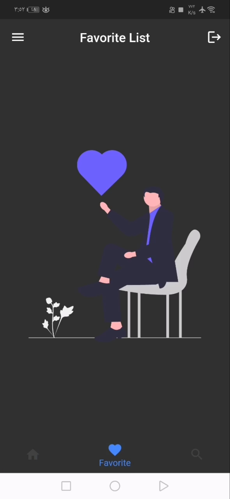

# movies

A app built with flutter and [TMDB api](https://www.themoviedb.org/documentation/api)

## Features:

- get top rated, popular, now playing and upcoming movies.
- save movies in favorite to watch another time.
- search among 794,271 movies.
- get movies details, reviews and etc.

________________________________________________________

- Flutter / Dart
- beautiful Ui 
- Rest APIs
- Shared preferences
- State Management (Provider)
- clean Code

#### GIF

#### Screenshots

________________________________________________________________________

This project is a starting point for a Flutter application.
A few resources to get you started if this is your first Flutter project:

- [Lab: Write your first Flutter app](https://docs.flutter.dev/get-started/codelab)
- [Cookbook: Useful Flutter samples](https://docs.flutter.dev/cookbook)

For help getting started with Flutter development, view the
[online documentation](https://docs.flutter.dev/), which offers tutorials,
samples, guidance on mobile development, and a full API reference.
